# VLAN Router-on-a-Stick Lab

This lab demonstrates inter-VLAN routing using the Router-on-a-Stick method.

Multiple VLANs are configured on a Layer 2 switch and connected to a router through an 802.1Q trunk link.  
The router uses subinterfaces with IEEE 802.1Q encapsulation to route traffic between VLANs.

## Objective

The goal of this lab is to configure inter-VLAN routing using the Router-on-a-Stick method with a Cisco router and Layer 2 switch.

## Topology

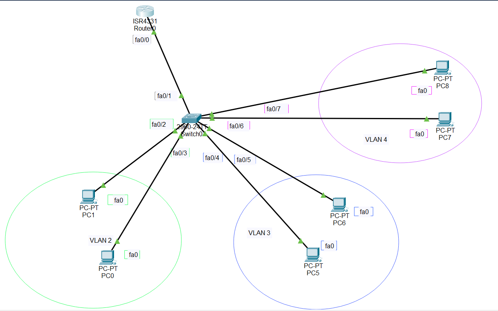

## VLANs

| VLAN | Network | Devices |
|-----|--------|--------|
| 2 | 192.168.2.0/24 | PC0, PC1 |
| 3 | 192.168.3.0/24 | PC5, PC6 |
| 4 | 192.168.4.0/24 | PC7, PC8 |

## Technologies

- Cisco Router
- Cisco Switch
- VLAN segmentation
- Router-on-a-Stick

## Skills Demonstrated

- VLAN configuration
- Switch access port configuration
- 802.1Q trunk configuration
- Router subinterfaces
- Inter-VLAN routing
- Network segmentation
- Connectivity testing using ping

## Router Interfaces

Verification of router subinterfaces:

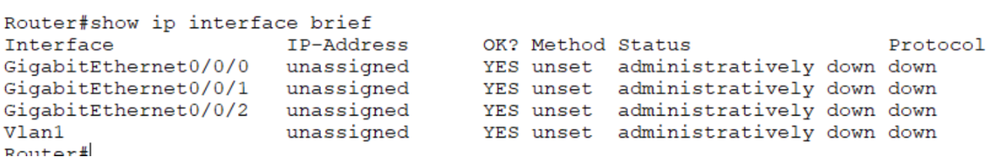

Note: Interface status before VLAN subinterface configuration.

## VLAN 2 Subinterface Configuration

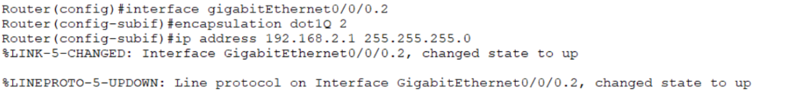

Note: The router subinterface for VLAN 2 is configured using 802.1Q encapsulation and assigned the IP address 192.168.2.1. Once configured, the interface state changes to **up**, allowing the router to act as the default gateway for VLAN 2.

Note: `dot1Q` stands for **IEEE 802.1Q**, the standard used for VLAN tagging in Ethernet networks. It allows the router to identify which VLAN incoming traffic belongs to. The number **2** represents the VLAN ID, meaning this subinterface processes traffic for **VLAN 2**.

## VLAN 3 Subinterface Configuration

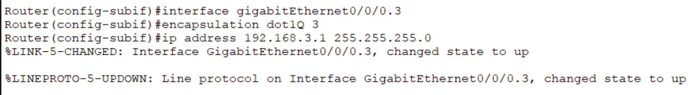

Note: The router subinterface GigabitEthernet0/0/0.3 is configured with 802.1Q encapsulation for VLAN 3 and assigned the IP address 192.168.3.1. The router now acts as the default gateway for devices in VLAN 3.

## VLAN 4 Subinterface Configuration

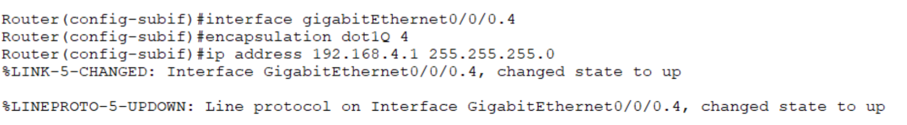

Note: The router subinterface GigabitEthernet0/0/0.4 is configured with IEEE 802.1Q encapsulation for VLAN 4 and assigned the IP address 192.168.4.1. The router acts as the default gateway for devices in VLAN 4.

## Router Interface Verification

Note: The output of `show ip interface brief` confirms that the router subinterfaces are operational and ready to handle inter-VLAN routing.

## Create VLANs on Switch

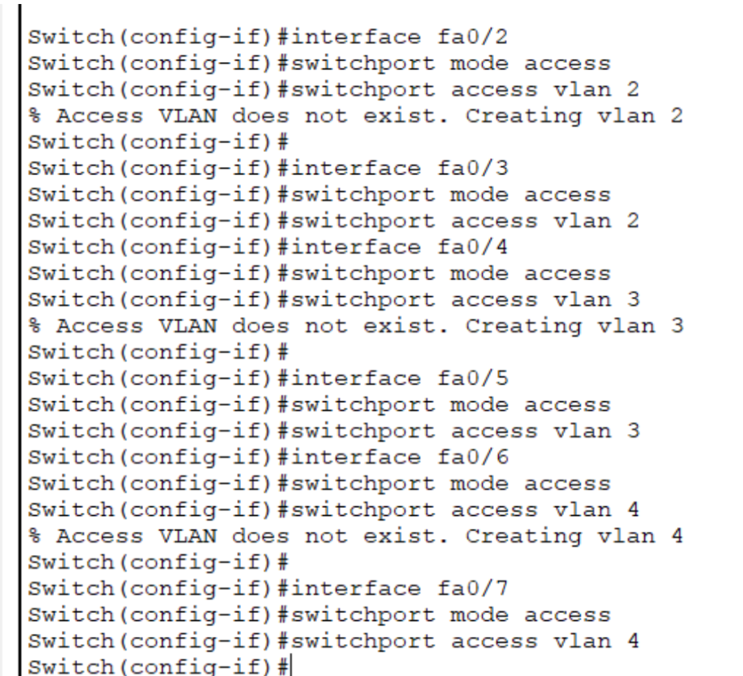

Note: VLAN 2, VLAN 3, and VLAN 4 are created on the switch to segment the network into separate broadcast domains.

## Switch Trunk Port Configuration

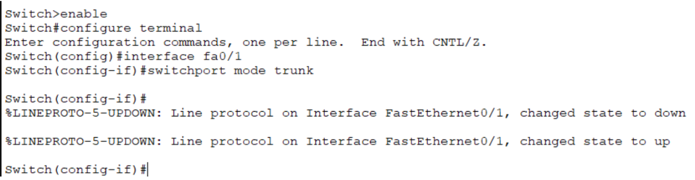

Note: The switch port connected to the router is configured as a trunk port. This allows multiple VLANs to travel over the same physical link using IEEE 802.1Q tagging.

## PC IP Configuration

Devices in each VLAN are assigned IP addresses within their respective subnet.

### VLAN 2
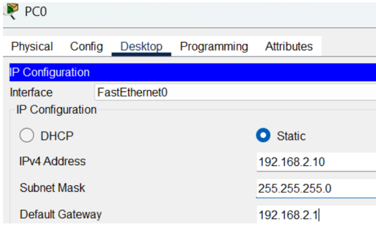

IP Address: 192.168.2.10  
Subnet Mask: 255.255.255.0  
Default Gateway: 192.168.2.1  

### VLAN 3
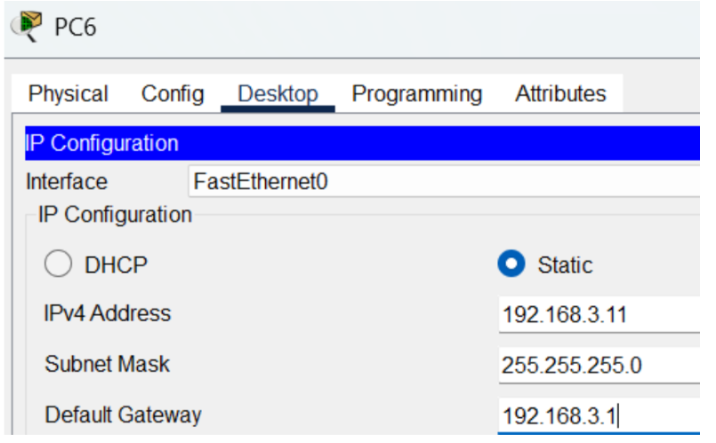

IP Address: 192.168.3.11  
Subnet Mask: 255.255.255.0  
Default Gateway: 192.168.3.1  

### VLAN 4
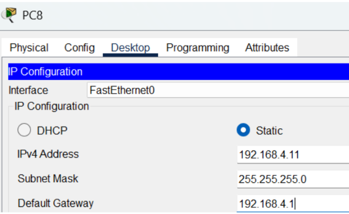

IP Address: 192.168.4.11  
Subnet Mask: 255.255.255.0  
Default Gateway: 192.168.4.1

## Inter-VLAN Routing Tests

### VLAN 2 → Router Interface (VLAN 3)

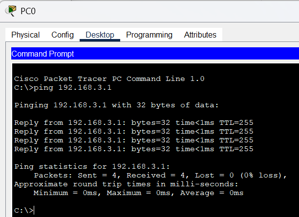

A host in VLAN 2 successfully pings the router subinterface in VLAN 3.

---

### Inter-VLAN Communication

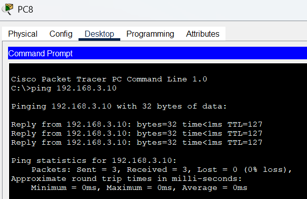

Devices in different VLANs are able to communicate through the router-on-a-stick configuration.

## Packet Tracer Lab

You can download and open the lab in Cisco Packet Tracer.

[vlan-router-on-a-stick.pkt](vlan-router-on-a-stick.pkt)

Open the Packet Tracer file to explore the full network topology and test the VLAN routing configuration.
